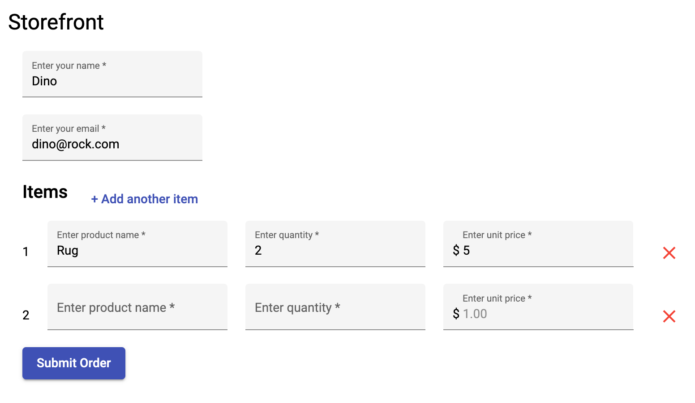

# ibf2021-paf-d3-workshop

Workshop full stack app using Angular frontend, Spring Boot backend and MySQL persistence

## Home view

Total Cost is returned from SQL aggregation query

## Add new order form view

Adding new order using Angular reactive form

### Note

This is a minimal app to learn the concepts of data flow from the frontend to backend to database and is not a fully fleshed out application.
